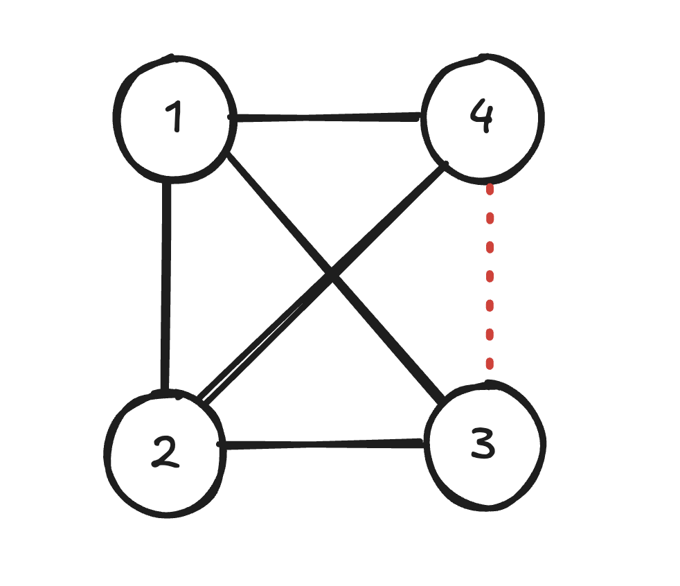
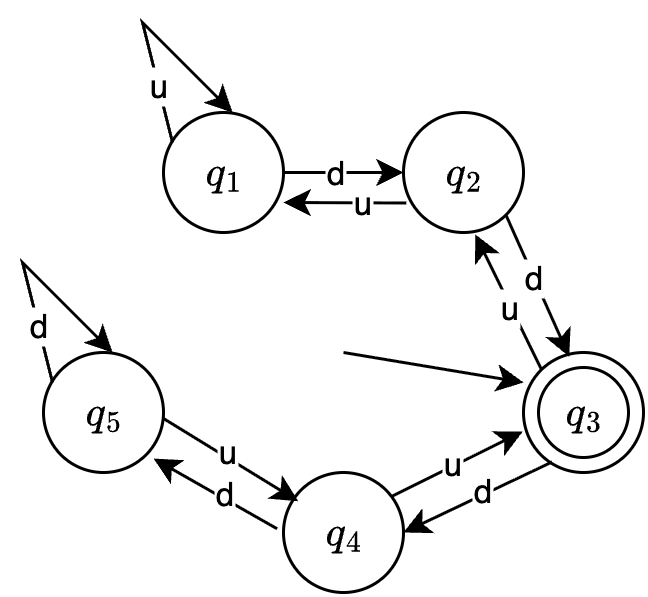

# L0.2
## 1
1. 这个集合包含了所有的正奇数
2. 这个集合包含了所有的偶数
3. 这个集合包含了 $\mathbb{N}$ 中所有 $6$ 的倍数
4. 这个集合包含了所有 01 回文字符串
5. 这个集合是一个空集

## 2
1. $\{1, 10, 100\}$
2. $\{n \in \mathbb{N} \mid n > 5\}$
3. $\{0, 1, 2, 3, 4\}$
4. $\{\text{aba}\}$

## 3
1. $A$ 不是 $B$ 的子集, 但是 $B$ 是 $A$ 的子集.
2. $A \cup  B = \{x, y, z\}$, $ A \cap B = \{x, y\}$, $A \times B = \{(x, x), (x, y), (y, x), (y, y), (z, x), (z, y)\}$
3. $\mathcal{P}(B) = \{\emptyset, \{x\}, \{y\}, \{x, y\}\}$

## 4

每一个顶点的度数为 **1**: 3; **2**: 3; **3**: 2; **4**: 2.

# L0.3 - L1.2
## 1
假设一个含有 $N$ 的顶点的图的每一个顶点的度数都不同, 而一个顶点的度数至少为 $0$, 最多为 $N-1$, 所以这 $N$ 个顶点的度数只能是 $0, 1, 2, \ldots, N-1$ 这 $N$ 个数. 但是如果有一个顶点的度数为 $N-1$, 那么就不可能有一个顶点的度数为 $0$, 因为这个度数为 $N-1$ 的顶点已经和图中的所有其他顶点相连了. 所以假设不成立, 至少有两个顶点的度数是相同的.

## 2
如果素数只有有限个, 那么一定有最大的一个素数, 记为 $p$. 我们考虑所有小于等于 $p$ 的素数 $p_1, p_2, \ldots, p_k$, 那么 $N = p_1 \times p_2 \times \cdots \times p_k + 1$ 一定也是素数, 因为 $N$ 不能被任何一个素数 $p_1, p_2, \ldots, p_k$ 整除. 但是 $N > p$, 这和 $p$ 是最大的素数矛盾, 所以素数有无穷多个.

## 3
1. 设 $S(n) = \dfrac{1}{2} n(n+1)$, 当 $n=1$ 时, $S(1) = 1$, 命题成立. 假设当 $n=k$ 时命题成立, 即 $S(k) = \dfrac{1}{2} k(k+1)$, 那么当 $n=k+1$ 时, 

$$
S(k+1) = S(k) + (k+1) = \dfrac{1}{2} k(k+1) + (k+1) = \dfrac{1}{2} (k+1)(k+2)
$$

所以当 $n=k+1$ 时命题也成立. 根据数学归纳法, 对任意的 $n \in \mathbb{N}^+$, 都有 $S(n) = 1 + 2 + \cdots + n$.

再设 $C(n) = \dfrac{1}{4}n^2(n+1)^2$, 当 $n=1$ 时, $C(1) = 1$, 命题成立. 假设当 $n=k$ 时命题成立, 即 $C(k) = \dfrac{1}{4}k^2(k+1)^2$, 那么当 $n=k+1$ 时,
$$
\begin{aligned}
C(k+1) &= \dfrac{1}{4}(k+1)^2(k+2)^2 \\
&= \dfrac{1}{4}(k+1)^2 (k^2 + 4k + 4) \\
&= \dfrac{1}{4}(k+1)^2 k^2 + (k+1)^2 k + (k+1)^2 \\
&= C(k) + (k+1)^3
\end{aligned}
$$

所以当 $n=k+1$ 时命题也成立. 根据数学归纳法, 对任意的 $n \in \mathbb{N}^+$, 都有 $C(n) = 1^3 + 2^3 + \cdots + n^3$.

## 4
1. $M_1$ 的起始状态为 $q_1$, 接受状态集为 $\{q_2\}$; $M_2$ 的起始状态为 $q_1$, 接受状态集为 $\{q_1, q_4\}$.
2. $M_1$ 的状态序列为 $q_1q_2q_3q_1q_1$; $M_2$ 的状态序列为 $q_1q_1q_1q_2q_4$.
3. $M_1$ 不接受, $M_2$ 接受.
4. $M_1$ 不接受, $M_2$ 接受.

## 5

## 6
## 7
## 8